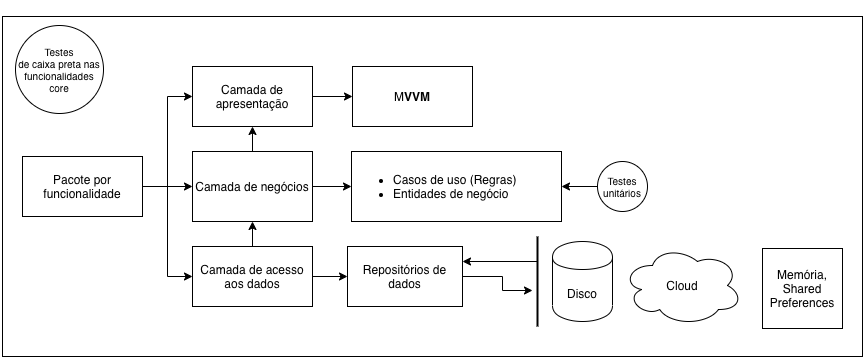

# IdDog

IdDog a aplicação Android do desafio da [idwall](https://idwall.co/)

## Começando

Para começar a usar, basta entrar com seu e-mail e a autenticação estará sendo processada.

Você poderá ver fotos de raças de cachorros, entre eles, husky, beagle, labrador e pug xD

### Pré-requisitos

```
    - Um e-mail válido
    - Um token incorporado ao app
    - Acesso à internet
    - Mínimo Android 4.1 ou posterior 
```

### Preparando seu ambiente de desenvolvimento

```
    1. Clone o projeto
    2. Abra o projeto em qualquer versão do Android Studio
```

### Demonstração


## Arquitetura



## Testes
```
    ./gradlew test - Para rodar os testes unitários
    ./gradlew connectedAndroidTest - Para rodar os testes instrumentados
```

## Construído com

* [--]() - lib desc

## Autor

* [L. Fernando](https://github.com/ferrugemm)