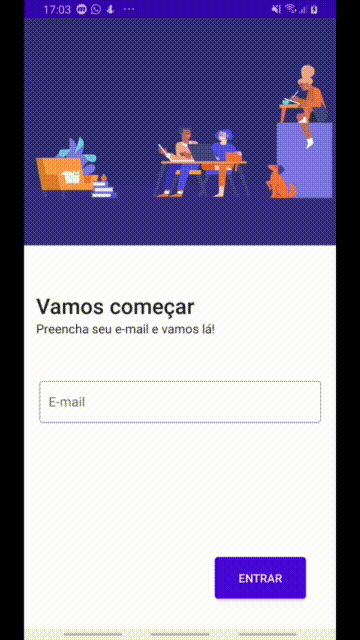

# IdDog

IdDog a aplicação Android do desafio da [idwall](https://idwall.co/)

## Começando

Para começar a usar, basta entrar com seu e-mail e a autenticação estará sendo processada.

Você poderá ver fotos de raças de cachorros, entre eles, husky, beagle, labrador e pug xD

### Pré-requisitos

```
    - Um e-mail válido
    - Um token incorporado ao app
    - Acesso à internet
    - Mínimo Android 4.1 ou posterior 
```

### Preparando seu ambiente de desenvolvimento

```
    1. Clone o projeto
    2. Abra o projeto em qualquer versão do Android Studio
```

### Demonstração


## Arquitetura


## Testes
```
    ./gradlew test - Para rodar os testes unitários
    ./gradlew connectedAndroidTest - Para rodar os testes instrumentados
```

## Construído com
### Google
* [materia](https://github.com/material-components/material-components-android) - Material provê uma forma customizável de criar componentes de tela para Android seguindo Design System estabelecido pela Google

### Kotlin    
* [stdlib](https://github.com/JetBrains/kotlin/tree/master/libraries/stdlib) - Kotlin stdlib dá o kit essencial para se trabalhar com Kotlin
* [coroutines](https://github.com/Kotlin/kotlinx.coroutines) - Kotlin Coroutines foi usado para dar o poder async em processos do app

### Koin
* [koinAndroid](https://github.com/InsertKoinIO/koin) - Koin Android está sendo usado para prover as dependências e a construção de objetos sob demanda
* [koinAndroidXScope](https://github.com/InsertKoinIO/koin) - Koin AndroidX Scope é usado para evitar repetições de código Android quando configurar a árvore de objetos
* [koinAndroidXViewModel](https://github.com/InsertKoinIO/koin) - Koin AndroidX ViewModel é utilizado para se adequar ao padrão arquitetural MVVM e construir de maneira correta componentes dessa guide

### Squareup
* [retrofit](https://square.github.io/retrofit/) - Retrofit está sendo usado para fazer chamadas async nos serviços IdDog
* [retrofitMoshi](https://github.com/square/retrofit/tree/master/retrofit-converters/moshi) - Moshi Converter está sendo usado para converter dados de um protocolo para um modelo de dados local
* [moshi](https://github.com/square/moshi) - Moshi com papel principal de serializar e deserializar um json para um objeto seguro no Kotlin
* [moshiCodeGen](https://github.com/square/moshi) - Moshi Code Gen auto gera código para poder serializar e desserializar objetos entre rede

### Airbnb
* [lottie](https://github.com/airbnb/lottie-android) - Android Lottie do site https://lottiefiles.com/ foi utilizada para exibir animação json de entrada para o usuário

### Android
* [lifecycleKtx](https://developer.android.com/jetpack/androidx/releases/lifecycle) - Android core lib para poder fazer o auto reconhecimento de quando há mudança no ciclo de vida de uma aplicação Android
* [coreKtx](https://developer.android.com/kotlin/ktx?hl=pt-br) - Componente Android para fornecer uma forma de lidar de forma idiomática e concisa com componentes Jetpack
* [appCompat](https://developer.android.com/jetpack/androidx/releases/appcompat) - Android lib Jetpack para componentes em tela
* [constraintLayout](https://developer.android.com/jetpack/androidx/releases/constraintlayout) - Android lib Jetpack para dar recursos ao layouts do app uma maneira simples de arrajar e até mesmo animar as views
* [roomKtx](https://developer.android.com/kotlin/ktx#room) - Kotlin lib utilizada para transações no banco de dados local usando Coroutines
* [roomRuntime](https://developer.android.com/jetpack/androidx/releases/room) - Android lib Jetpack utilizada para prover acesso mais rápido do runtime do banco de dados local
* [navigationFragment](https://developer.android.com/jetpack/androidx/releases/navigation) - Android lib jetpack utilizada para navegar entre telas (ou destinos)
* [navigationUi](https://developer.android.com/jetpack/androidx/releases/navigation) - Android lib jetpack utilizada para navegar entre telas
* [viewmodelKtx](https://developer.android.com/jetpack/androidx/releases/lifecycle) - Android lib jetpack sendo utilizada para prover escopos de Coroutines necessários para iniciar um processo nessa arch guide 
* [liveDataKtx](https://developer.android.com/jetpack/androidx/releases/lifecycle) - Android lib jetpack sendo utilizada para prover escopos e propriedades reativas entre a View e a ViewModel
* [lifecycleRuntime](https://developer.android.com/jetpack/androidx/releases/lifecycle) - Android lib jetpack para organizar e iniciar Coroutines na camada de View (Activity ou Fragment) por meio do seu escopo lifecycle
* [multidex](https://developer.android.com/studio/build/multidex) - Android lib utilizada para permitir a leitura de um arquivo DEX (Código Dalvik Executável) com mais de 65.536 métodos 
* [roomCompiler](https://developer.android.com/jetpack/androidx/releases/room) - Kotlin lib utilizada para transações no banco de dados local

### Simplepass
* [loadingButton](https://github.com/leandroBorgesFerreira/LoadingButtonAndroid) - Android lib contendo uma custom view para fazer o botão ter dois estados, um de loading e outro no estado ocioso

### Coil
* [coil](https://coil-kt.github.io/coil/) - Android lib para carregamento de imagens usando Coroutines

### Libs para testes unitários
* [mockWebServer](https://github.com/square/okhttp/tree/master/mockwebserver) - Lib para testar servidores HTTP e simular chamadas em testes
* [junit](https://github.com/junit-team/junit4) - Lib para testar condições esperadas em testes
* [mockk](https://mockk.io/) - Lib para realizar mock de chamadas entre classes ou arquivos

### Libs para testes instrumentados
* [espresso](https://developer.android.com/training/testing/espresso) - Android lib para testar a UI de forma concisa e em cenários onde testes de caixa preta devem acontecer
* [androidRules](https://developer.android.com/reference/androidx/test/rule/package-summary) - Android lib para poder fazer testes de componentes de UI Android

## Autor

* [L. Fernando](https://github.com/ferrugemm)